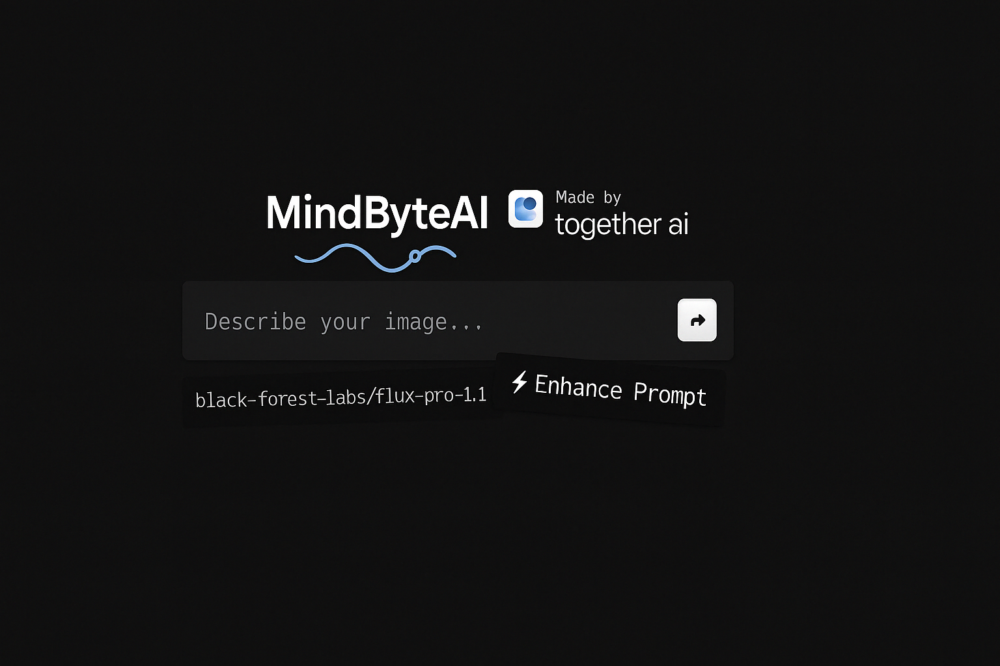

<a href="https://www.mindbyteai.org">
  
  <h1 align="center">MindByteAI</h1>
</a>

<p align="center">
  An open-source real-time AI image generation engine built for creators, builders, and innovators. <br/>
  Powered by Flux, integrated with blockchain. Fast, flexible, and future-facing.
</p>

---

## 🚀 What is MindByteAI?

**MindByteAI** is a modern image-generation platform designed for those who move fast — founders, designers, marketers, and product teams.

- Enter a prompt.
- Generate high-quality visuals in milliseconds.
- (Soon) Mint them directly on-chain via Binance Smart Chain.

We combine the power of cutting-edge AI models like **Flux** with smooth UX and decentralized ownership to bring your ideas to life — instantly.

---

## 🧠 Why We're Building This

Traditional design tools slow you down.  
MindByteAI is built to **match the pace of thought** and give you **ownership** of your creations.

We believe in:

- Speed without compromise  
- Frictionless creativity  
- Full control and decentralization  
- Tools that stay out of your way  

---

## ⚙️ Tech Stack

- [Flux Schnell](https://togetherai.link/together-flux/) by Black Forest Labs (image model)
- [Together AI](https://togetherai.link) for real-time inference
- Next.js (App Router) + TailwindCSS
- Helicone for observability
- Plausible for analytics

---

## 🧪 Local Setup

1. Clone the repo-:
   ```bash
   git clone https://github.com/mindbyteai/app
